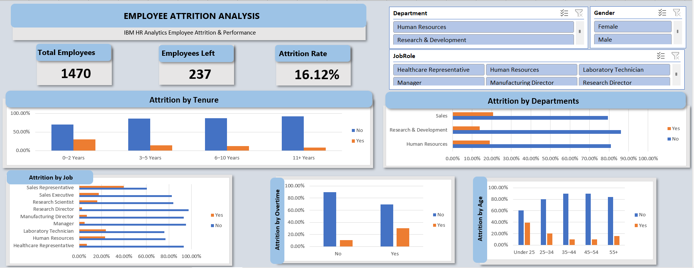
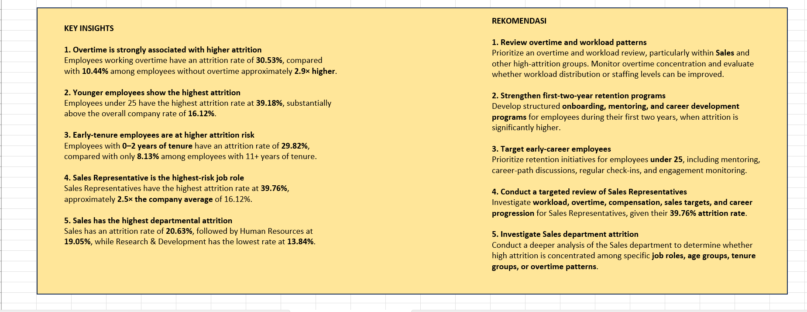

# hr-employee-attrition-analysis
End-to-end Excel analysis of employee attrition using the IBM HR Analytics dataset.

# HR Employee Attrition Analysis

## Overview

An end-to-end Excel data analytics project analyzing employee
attrition patterns using the IBM HR Analytics Employee Attrition
& Performance dataset.

The objective is to identify employee groups with higher
attrition rates and provide actionable insights that can
support employee retention strategies.

---

## Business Problem

Employee attrition can increase recruitment costs, reduce
workforce stability, and affect organizational performance.

This project analyzes employee characteristics and work
conditions to identify groups associated with higher attrition.

---

## Objectives

- Measure overall employee attrition
- Identify departments with higher attrition
- Identify high-risk job roles
- Analyze attrition by overtime status
- Analyze attrition across age groups
- Analyze attrition by employee tenure
- Provide actionable HR recommendations

---

## Tools

- Microsoft Excel
- PivotTables
- PivotCharts
- Slicers
- XLOOKUP / VLOOKUP
- Data Cleaning
- Excel Dashboard

---

## Analysis Workflow

Raw Data
↓
Data Cleaning
↓
Data Dictionary
↓
Pivot Analysis
↓
Dashboard
↓
Insights & Recommendations

---

## Key Findings

| Metric | Result |
|---|---:|
| Total Employees | 1,470 |
| Employees Left | 237 |
| Overall Attrition Rate | 16.12% |
| Attrition - Overtime Yes | 30.53% |
| Attrition - Under 25 | 39.18% |
| Attrition - 0–2 Years | 29.82% |
| Attrition - Sales Representative | 39.76% |
| Attrition - Sales Department | 20.63% |

### Key Insights

1. Employees working overtime have a substantially higher
   attrition rate than employees without overtime.

2. Employees under 25 have the highest attrition rate among
   the analyzed age groups.

3. Employees with 0–2 years of tenure show significantly
   higher attrition than long-tenured employees.

4. Sales Representatives have the highest attrition rate
   among job roles.

5. Sales has the highest attrition rate among departments.

---

## Recommendations

- Review overtime and workload patterns, particularly within
  high-attrition teams.
- Strengthen onboarding, mentoring, and career development
  during the first two years.
- Develop targeted retention initiatives for younger employees.
- Conduct a targeted review of Sales Representatives, including
  workload, sales targets, compensation, and career progression.
- Investigate attrition patterns within the Sales department.

---

## Dashboard Preview

### Employee Attrition Dashboard

### Key Insights

---

## Dataset

Dataset:
IBM HR Analytics Employee Attrition & Performance

Source:
Kaggle

The dataset was used for educational and portfolio analysis.

---

## Limitations

This analysis is descriptive and identifies associations
between employee characteristics and attrition.

The results should not be interpreted as proof of causal
relationships.

Further analysis using statistical testing or predictive
modeling could be conducted to investigate potential drivers
of employee attrition.
